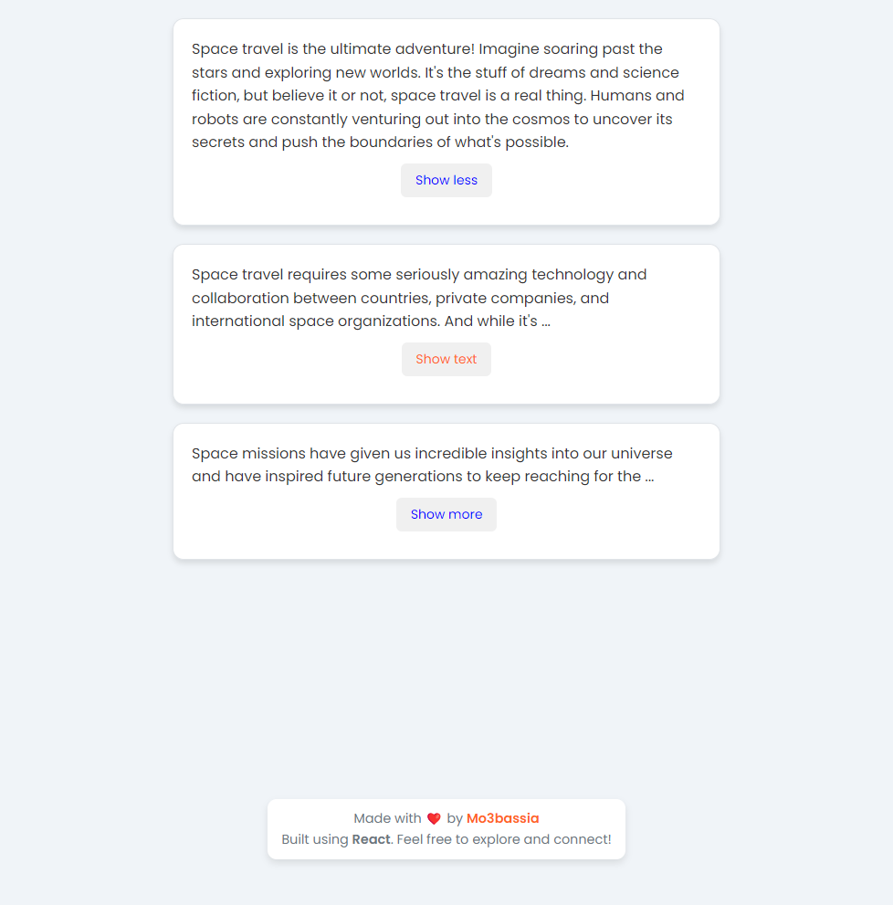

# Text Expander App 🚀

## Overview 🌟

The **Text Expander App** is a simple yet functional React application that showcases the power of **component composition** and **passing elements as props**. This app allows users to expand and collapse text sections dynamically, making it an engaging way to present content. It serves as an exercise in my React learning journey, focusing on practical implementations of core concepts.

## Live Demo 🌐

Check out the live demo of the application [here](https://text-expander-mo3bassias-projects.vercel.app).

## Features ✨

- 📖 **Dynamic Text Expansion**: Users can click a button to expand or collapse sections of text, revealing more or less content as desired.
- ✏️ **Customizable Button Text**: The app allows customization of button text for both expanding and collapsing actions.
- 🔄 **State Management**: Utilizes the `useState` hook to manage the open/closed state of each text section.
- ⚙️ **Props Usage**: Demonstrates passing props such as `collapsedNumWords`, `expandButtonText`, and `buttonColor` to control component behavior and appearance.
- 📱 **Responsive Design**: Ensures that the app is user-friendly on various devices with a clean layout.

## Technologies Used 🛠️

- **React**: The core library for building user interfaces.
- **JavaScript**: The programming language used for the application logic.
- **CSS**: For styling the components, ensuring a pleasant and modern user experience.

## Learning Journey 📚

I'm in the early stages of my React journey, exploring concepts like component composition, state management, and prop handling. This project is a practical exercise to reinforce my understanding and skills as I progress through my course.

## Conclusion 🎉

The **Text Expander App** serves as a foundational project demonstrating important React concepts. As I continue learning and experimenting, I aim to build more complex applications and deepen my understanding of React.

Feel free to explore the code and learn from it! 💻❤️
